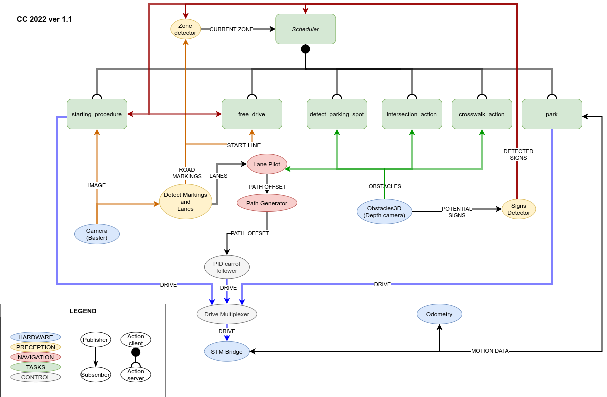

# Selfie


In *Selfie* project vehicles based on 1:10 scale RC cars are customized to be able to operate autonomously in simulated road environments.

# Selfie Carolo-Cup

This repository contains the [catkin workspace](http://wiki.ros.org/catkin/workspaces) for Selfie Autonomous Car for the [Carolo-Cup](https://www.tu-braunschweig.de/carolo-cup) competition.

## Build instructions

The project is targeting the [ROS Noetic](http://wiki.ros.org/noetic) distribution. Make sure you have it [installed](http://wiki.ros.org/noetic/Installation) on your development machine.

Clone the repository to a convenient location using:

```bash
git clone https://gitlab.com/KNR-Selfie/carolocup/carolocup.git
```

Navigate to the main directory with:

```bash
cd carolocup
```

The following set of commands will in turn download all external dependencies, build the packages in `src` directory and include them in your environment.

```bash
sudo apt install python3-rosdep
./src/Tools/setup/camera_basler/basler.sh
rosdep update
rosdep install --from-paths src --ignore-src --rosdistro=noetic
catkin_make
source ./devel/setup.bash
```

### Bonus:

If you want to init latest and official version of selfie simulator type:
```bash
git submodule update --init
```
<em>Note: You need to configure your gitlab profile SSH key</em>

### Bonus 2

If you use Visual Studio Code as your IDE you may find this link useful: https://github.com/pktiuk/vscode_ros_config

## System graph


