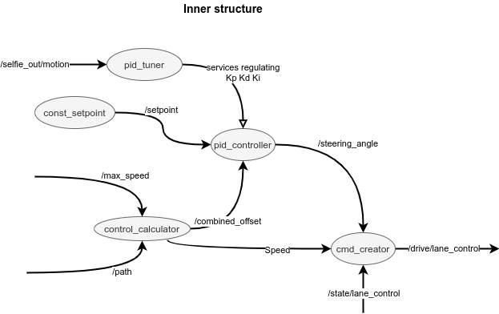

# PID carrot follower

PID-based system generating control commands for car.  
It regulates speed and steering angle based on current position and curvature of path.

Consist of nodes:

- cmd_creator - generates command from base values (like speed, angle, acceleration etc.) and changes mode of pid_tuner (default or lane_change)
- pid_controller ([link](http://wiki.ros.org/pid)) - pure pid regulator
- control_calculator - calculates offset based on path and max_speed
- const_setpoint - generates constant setpoint for PID
- pid_tuner - regulates PID parameters based on speed

## Inner structure of system - graph



## Usage

```bash
. devel/setup.bash
roslaunch pid_carrot_follower pid_carrot_follower_example.launch
```

## Topics

### Subscribed topics

- `/path` ([nav_msgs/Path](http://docs.ros.org/melodic/api/std_msgs/html/msg/Float64.html))
- `/max_speed` ([std_msgs/Float64](http://docs.ros.org/melodic/api/std_msgs/html/msg/Float64.html))

### Published topics

- `/drive/lane_control` ([custom_msgs/DriveCommand](./../../Shared/custom_msgs/msg/DriveCommand.msg))

## Parameters

- `L` (_float_)
  - Heading offset coefficient for calculating input to PID
- `lookahead` (_float_)
  - Distance from the car where offsets are calculated [m]
- `min_speed` (_float_)
  - Min speed of the car [m/s]
- `max_acceleration` (_float_)
  - max acceleration of the car
- `max_curvature` (_float_)
  - max possible curvature (linear speed control)
- `pid_tuner_disabled` (_bool_)
  - whether or not PID tuner is activated
- `L_Kp` (_float_)
  - Kp for low range of speed
- `L_Ki` (_float_)
  - Ki for low range of speed
- `L_Kd` (_float_)
  - Kd for low range of speed
- `M_Kp` (_float_)
  - Kp for medium range of speed
- `M_Ki` (_float_)
  - Ki for medium range of speed
- `M_Kd` (_float_)
  - Kd for medium range of speed
- `H_Kp` (_float_)
  - Kp for high range of speed
- `H_Ki` (_float_)
  - Ki for high range of speed
- `H_Kd` (_float_)
  - Kd for high range of speed
- `LaneChange_Kp` (_float_)
  - Kp for lane change manuver
- `LaneChange_Ki` (_float_)
  - Ki for lane change manuver
- `LaneChange_Kd` (_float_)
  - Kd for lane change manuver
- `M_speed` (_float_)
  - lower bound for medium range of speed [m/s]
- `H_speed` (_float_)
  - lower bound for low range of speed [m/s]
- `speed_change_treshold` (_float_)
  - the smallest change of speed for PID modification to be considered [m/s]
