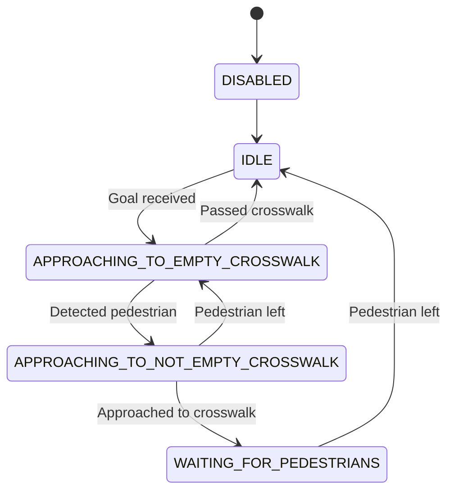

# Crosswalk action

Crosswalk node - node activated when crosswalk is detected. It manages detection of pedestrians and waiting for them.

Server uses `crosswalk.action` to communicate with client.

## Topics

### Action name

- `task/crosswalk`

### Subscribed topics

- `/obstacles` ([custom_msgs/Box2DArray](./../../Shared/custom_msgs/msg/Box2DArray.msg))
- `/road_lines`

### Published topics

## Parameters

- `roi_min_x`, `roi_max_x`, `roi_min_y`, `roi_max_y` (_float_)
  - describing area of interest
